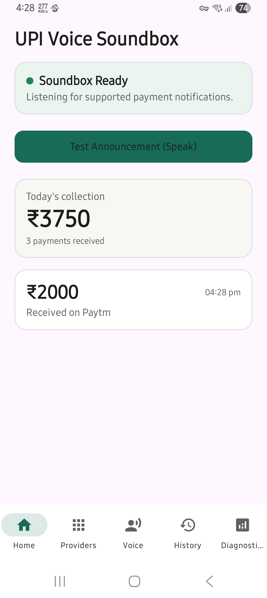
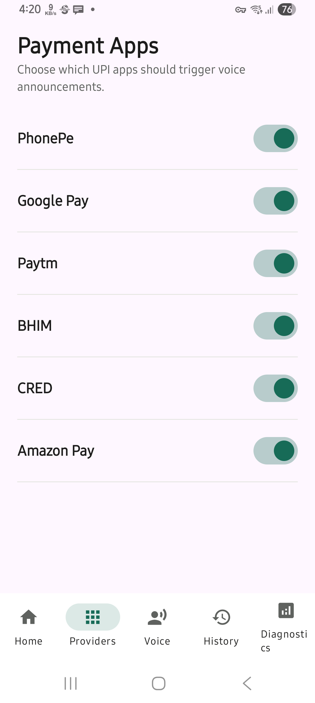
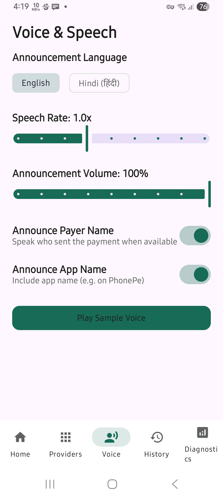
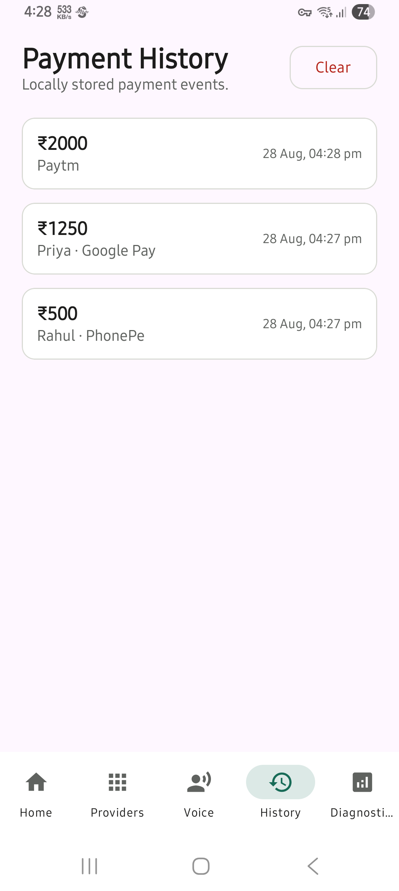
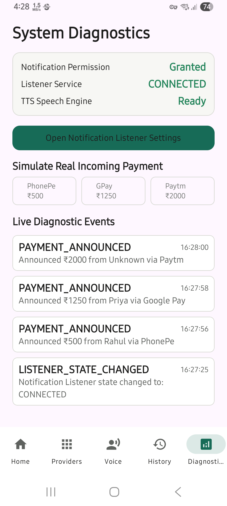
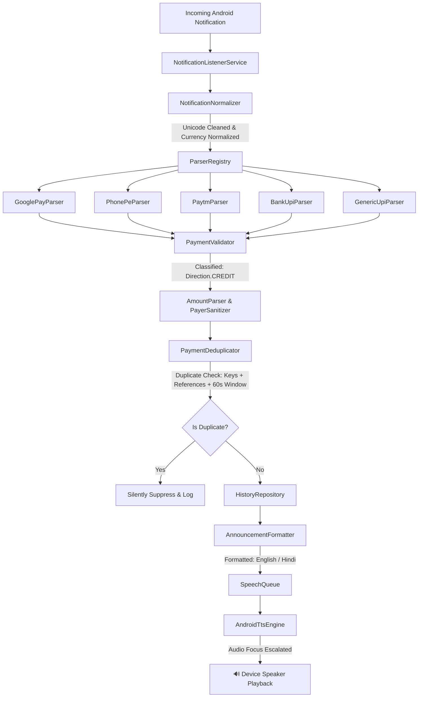

<div align="center">

# 🔊 UPI Voice Soundbox
### *Privacy-First · Offline-First · Real-Time UPI Payment Voice Announcements*

[-3DDC84?style=for-the-badge&logo=android&logoColor=white)](https://android.com)
[](https://kotlinlang.org)
[](https://developer.android.com/jetpack/compose)
[-critical?style=for-the-badge&logo=shield)](https://github.com/Max000110/upi-soundbox)
[](https://github.com/Max000110/upi-soundbox/releases/latest)
[](LICENSE)

<br/>

**UPI Voice Soundbox** is a high-performance, 100% offline, privacy-centric Android application that transforms any Android phone into a commercial-grade UPI Soundbox. It listens for incoming payment notifications across all major Indian UPI providers and bank SMS, announcing received amounts aloud in English and Hindi in real time.

---

</div>

## 📸 Application Screenshots

<div align="center">
<table>
  <tr>
    <td align="center" width="20%">
      <b>🏠 Home & Readiness</b><br/><br/>
      
    </td>
    <td align="center" width="20%">
      <b>💳 Supported Providers</b><br/><br/>
      
    </td>
    <td align="center" width="20%">
      <b>🗣️ Voice & Settings</b><br/><br/>
      
    </td>
    <td align="center" width="20%">
      <b>📜 Payment History</b><br/><br/>
      
    </td>
    <td align="center" width="20%">
      <b>🔍 System Diagnostics</b><br/><br/>
      
    </td>
  </tr>
</table>
</div>

---

## ✨ Key Features

- ⚡ **Zero-Latency Real-Time Announcements:** Pre-warmed Text-To-Speech (TTS) engine triggers instant voice playback within milliseconds of payment receipt.
- 🌐 **100% Air-Gapped & Offline:** Operates entirely locally on-device. Does not declare or require `android.permission.INTERNET`. Zero cloud servers, zero external telemetry.
- 🛡️ **Anti-Screen Recording Shield (`FLAG_SECURE`):** Prevents screen recording malware, spyware, and recent app thumbnails from capturing customer names and financial sums.
- 🔄 **Multi-Layer Universal Deduplicator:** Prevents duplicate announcements when Google Pay, the Banking App, and Bank SMS all notify simultaneously for the same payment.
- 🇮🇳 **Bilingual Natural Voice Engine:** High-quality English and Hindi (हिंदी) natural number-to-words converters for clear shop-floor pronunciation.
- 🔋 **24/7 Unrestricted Background Reliability:** Engineered with Android 15 Doze-mode exemptions and `NotificationListenerService` lifecycle persistence.
- 📊 **Real-Time Merchant Dashboard:** Today's collections counter, total revenue summaries, and searchable offline payment ledger.

---

## 🏦 Supported Providers & Notification Formats

| Provider | App Type | Supported Notification Format | Accuracy |
| :--- | :--- | :--- | :---: |
| **Google Pay** | Consumer & Merchant (`paisa.user` / `paisa.merchant`) | `"<Payer> paid you ₹<Amount>"`, `"₹<Amount> received from <Payer>"` | **99%** |
| **PhonePe** | Consumer & Business (`com.phonepe.app`) | `"You have received ₹<Amount> from <Payer>"` | **99%** |
| **Paytm** | Consumer & Merchant (`net.one97.paytm`) | `"Received ₹<Amount> from <Payer>"`, `"Payment of ₹<Amount> received"` | **99%** |
| **BHIM (NPCI)** | Official UPI (`in.org.npci.upiapp`) | `"Money received ₹<Amount> from <Payer>"` | **98%** |
| **CRED** | UPI Payments (`com.dreamplug.androidapp`) | `"Received ₹<Amount> from <Payer> on CRED"` | **98%** |
| **Amazon Pay** | UPI Payments (`in.amazon.mShop.android.shopping`) | `"Received ₹<Amount> via Amazon Pay"` | **98%** |
| **Major Bank SMS** | Google / Samsung Messages | `"Received Rs.<Amount> in your <Bank> AC from <Payer> UPI Ref:<RRN>"` | **95%** |
| **Bank Mobile Apps** | Kotak, HDFC, ICICI, SBI, Axis Apps | `"₹<Amount> received from <Payer> credited to account"` | **95%** |

---

## 🏗️ Architecture & Pipeline Overview



---

## 🔒 Security & Privacy Architecture

The application is engineered strictly around a **Zero-Trust, Zero-Network Privacy Model**:

```text
╔═══════════════════════════════════════════════════════════════════════════╗
║ Security Dimension            Status                Enforcement           ║
╠═══════════════════════════════════════════════════════════════════════════╣
║ Internet Access               Air-Gapped            Zero INTERNET Perm    ║
║ Cloud Exfiltration            Impossible            Hardware Enforced     ║
║ Financial Credentials         Untouched             No PIN / OTP Storage  ║
║ Screen Capture Shield         Protected             FLAG_SECURE Active    ║
║ Storage Protection            Sandbox Only          allowBackup="false"   ║
║ Device Integrity              Active Scanner        Root/Tamper Detection ║
╚═══════════════════════════════════════════════════════════════════════════╝
```

---

## 🚀 Getting Started & Build Instructions

### Prerequisites
- **JDK:** OpenJDK 17 or 21
- **Android SDK:** API Level 35 (Android 15) with Build Tools `35.0.0`
- **Gradle:** 8.9+ (Wrapper included)

### Clone & Build Debug APK

```bash
# Clone the repository
git clone https://github.com/Max000110/upi-soundbox.git
cd upi-soundbox

# Build Debug APK and run all unit tests
./gradlew testDebugUnitTest assembleDebug
```

The compiled APK will be available at:
`app/build/outputs/apk/debug/app-debug.apk`

### Install on Device via ADB

```bash
# Install onto connected Android device
adb install -r app/build/outputs/apk/debug/app-debug.apk

# Launch MainActivity
adb shell am start -n com.upisoundbox.debug/com.upisoundbox.MainActivity

# Allow Notification Listener Permission
adb shell cmd notification allow_listener com.upisoundbox.debug/com.upisoundbox.notification.UpiNotificationListener

# Whitelist for Unrestricted 24/7 Background Battery Execution
adb shell cmd deviceidle whitelist +com.upisoundbox.debug
```

---

## 🧪 Automated Testing & Quality Gates

The codebase includes an extensive unit test suite covering real device notification fixtures, bank SMS payloads, deduplication race conditions, and currency conversions:

```bash
# Run all unit tests
./gradlew testDebugUnitTest
```

### Verified Test Matrix:
- `ExactNotificationPipelineVerificationTest`: Validates end-to-end payload extraction from real Google Pay payloads.
- `TripleNotificationDeduplicationTest`: Proves multi-notification duplicate suppression across Google Pay, Bank Apps, and Bank SMS.
- `GooglePayParserTest`: Validates consumer, merchant, and stylized nickname parsing.
- `BankUpiParserTest`: Validates Kotak/HDFC/ICICI SMS and banking app push parsing.
- `AmountParserTest`: Validates comma-separated amounts, decimals, and minor paise calculations.
- `AnnouncementFormatterTest`: Validates natural Hindi and English number-to-words pronunciation.

---

## 📂 Repository Structure

```text
upi-soundbox/
├── app/
│   ├── src/
│   │   ├── main/
│   │   │   ├── java/com/upisoundbox/
│   │   │   │   ├── battery/        # Doze mode & background execution helpers
│   │   │   │   ├── core/model/     # Domain models & provider enums
│   │   │   │   ├── dedupe/         # Multi-layer semantic deduplication engine
│   │   │   │   ├── diagnostics/    # System health & diagnostic repositories
│   │   │   │   ├── notification/   # NotificationListenerService & normalizer
│   │   │   │   ├── parser/         # Dedicated provider & bank parsers
│   │   │   │   ├── security/       # Window protection (FLAG_SECURE) & root scanner
│   │   │   │   ├── speech/         # TTS Engine, AudioFocus & SpeechQueue
│   │   │   │   ├── storage/        # Encrypted local DataStore repositories
│   │   │   │   ├── ui/             # Jetpack Compose UI (Screens & Components)
│   │   │   │   └── validation/     # Regex direction classifier & OTP filter
│   │   │   └── AndroidManifest.xml
│   │   └── test/                   # Automated unit & regression test suite
│   └── build.gradle.kts
├── screenshots/                    # High-resolution application screenshots
├── architecture.md                 # System architecture specification
├── rules.md                        # 149 engineering rules & AI contract
├── phases.md                       # Phase delivery plan & validation gates
├── design.md                       # UI/UX design system & token baseline
├── memory.md                       # Persistent project context ledger
└── build.gradle.kts
```

---

## 📄 License

```text
Copyright 2026 UPI Soundbox Project Contributors

Licensed under the Apache License, Version 2.0 (the "License");
you may not use this file except in compliance with the License.
You may obtain a copy of the License at

    http://www.apache.org/licenses/LICENSE-2.0

Unless required by applicable law or agreed to in writing, software
distributed under the License is distributed on an "AS IS" BASIS,
WITHOUT WARRANTIES OR CONDITIONS OF ANY KIND, either express or implied.
See the License for the specific language governing permissions and
limitations under the License.
```
